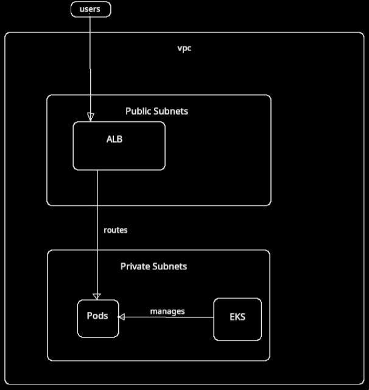

# Project Documentation

## Table of Contents
1. [Setup Instructions](#setup-instructions)
2. [Architecture Explanation](#architecture-explanation)
3. [Pipelines Description](#pipelines-description)

---

## Setup Instructions

### Prerequisites

- **Software Dependencies for Local Environment:**
  - Python 3.8+
  - Kubectl
  - minikube
  - Docker
  - Git

### Installation Steps
#### Local

#### 1. Environment Setup
- Make use of the scripts provided in util folder:

```bash
# Create Local cluster
./util/setup-minikube.sh start

# Apply manifests
./util/setup-minikube.sh apply

```

#### 2. Docker images are pulled from registry
- Use build script with your own settings
- Option to build and pull from local

#### Terraform
- Build images to Registry using build scripts
- Prepare bucket for state backend.
- Init, Plan, and Apply from terraform directory

## Architecture Explanation

### System Overview
AWS EKS-based container platform with Application Load Balancer
### Architecture Diagram

### Component Details

#### Networking
- **VPC:** 10.0.0.0/16 with public/private subnets across 2 AZs
- **Public Subnets:** Host ALB and NAT Gateways
- **Private Subnets:** Host EKS worker nodes
- **Security Groups:** Restrict traffic between ALB and nodes

#### EKS Cluster
- **Control Plane:** Managed by AWS
- **Worker Nodes:** 2x t3.small instances in Auto Scaling Group

#### Load Balancing
- **Application Load Balancer:** Routes HTTP traffic from internet
- **Target Group:** Points to NodePort 30080 on worker nodes
- **Health Checks:** Monitors `/greeting` endpoint

### Data Flow
1. **Internet Traffic:** Hits ALB on port 80
2. **Load Balancing:** ALB forwards to healthy EKS nodes on port 30080
3. **Kubernetes:** NodePort service routes to application pods
4. **Response:** Application responds through same path

### Security
- **IAM Roles:** Separate roles for EKS cluster and worker nodes
- **Network Isolation:** Private subnets for workloads
- **Security Groups:** Allow only necessary traffic flows


## Pipelines Description

### Overview
Two separate CI/CD pipelines for application and infrastructure deployment to AWS EKS, Defined using Github Workflows.

### Pipeline Types

#### 1. Application Pipeline Workflows
- **Testing:** Run unit tests on PR
- **Build:** Build and push to Docker Registry on Push to Main

#### 2. Infrastructure Pipeline
- **Validate:** Init, validate, and plan on PR
- **Build:** Apply on Push to Main, after successfull PR merge.
